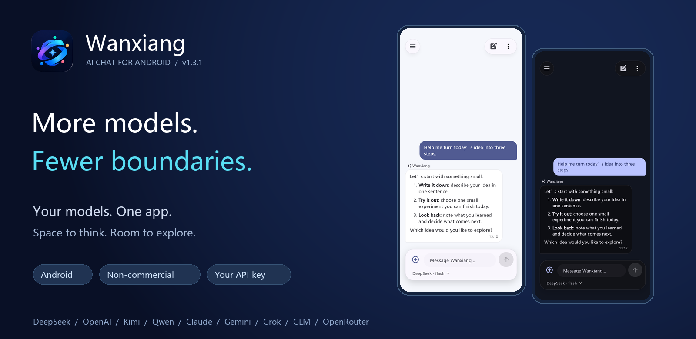

  
  <h1>Wanxiang · 万象</h1>
  
<strong>English</strong> | <a href="README.zh-CN.md">简体中文</a>

  
<strong>More models. More possibilities in every conversation.</strong>

  
A source-available AI chat app for Android · Choose your models · Bring your own API key

  

    <a href="https://github.com/tingwu-h/wanxiang-chat-app/releases/download/v1.3.0/wanxiang-v1.3.0.apk">Download APK</a> ·
    
    
    
    
  

  

    <a href="https://github.com/tingwu-h/wanxiang-chat-app/releases/tag/v1.3.0">v1.3 Release</a> ·
    <a href="#preview">Preview</a> ·
    <a href="#quick-start">Quick Start</a> ·
    <a href="#providers">Providers</a> ·
    <a href="docs/1.3-更新说明.md">Release Notes (中文)</a>
  

  

## Meet Wanxiang

**Wanxiang** is a source-available AI chat app for Android. It brings providers such as DeepSeek, OpenAI, Kimi, and Qwen into one app, so you can choose a model that fits your question and chat with text, images, and plain-text attachments.

Whether you are organizing an idea, discussing code, or asking about an image, Wanxiang keeps everyday conversations within reach: configure your providers, switch models when needed, and keep your discussions in local conversation history.

## Highlights

- **Choose your models** — Nine built-in providers and custom endpoints, with editable model IDs for your account.
- **Pick up where you left off** — Streaming replies and multiple conversations that remember their provider and model.
- **Go beyond text** — Send images and plain-text files to models that support the relevant capabilities.
- **Read comfortably** — Markdown replies with light and dark themes.
- **Keep your own configuration** — Bring your API keys; Android stores them locally using encryption.

## App Preview

<table>
  <tr>
    <td align="center"><strong>Light theme</strong></td>
    <td align="center"><strong>Dark theme</strong></td>
    <td align="center"><strong>Provider settings</strong></td>
  </tr>
  <tr>
    <td></td>
    <td></td>
    <td></td>
  </tr>
</table>

These previews use simulated conversations rendered by Flutter tests. They are not physical-device captures or live provider responses. The app is shown in Chinese; the README language switch changes documentation only.

## Connect Your Providers

| Provider | Default protocol | Configuration |
| --- | --- | --- |
| DeepSeek | OpenAI-compatible Chat Completions | DeepSeek API key and an available model |
| OpenAI | OpenAI Responses | OpenAI API key and an available model |
| Kimi · Moonshot | OpenAI-compatible Chat Completions | Moonshot API key and an available model |
| Qwen | OpenAI-compatible Chat Completions | DashScope API key; mainland China endpoint by default |
| Anthropic · Claude | Anthropic Messages | Anthropic API key and an available model |
| Google · Gemini | Google Gemini | Gemini API key and an available model |
| xAI · Grok | OpenAI-compatible Chat Completions | xAI API key and an available model |
| GLM · Zhipu | OpenAI-compatible Chat Completions | Zhipu API key and an available model |
| OpenRouter | OpenAI-compatible Chat Completions | OpenRouter API key; includes free model options |
| Custom | Choose from the four protocols above | Your base URL, API key, and model ID |

Presets make setup easier; they do not grant access to a model. Availability depends on your account, region, and provider. You can edit model IDs, endpoints, and image capability in settings. Compatible endpoints may differ in behavior.

## Start Your First Conversation

1. Visit the [v1.3 release page](https://github.com/tingwu-h/wanxiang-chat-app/releases/tag/v1.3.0) for release information and available files, or build the APK from source.
2. Open **Settings → Models & Services**, choose a provider, and enter your API key. Use **Get API Key** to open its official platform.
3. Select a model or enter a model ID available to your account. Adjust the base URL if needed.
4. Save your configuration. Optionally use **Test Connection**, then return to chat.
5. Switch the current provider’s model below the text input, inside the message composer. To change providers, open Settings → Models & Services. Before attaching images, check that your model supports vision.

Connection tests and conversations make real API requests and may incur charges. Providers manage API access, regional availability, and billing. Wanxiang is not affiliated with these providers.

<strong>Upgrading from DeepSeek Assistant</strong>

Version v1.3 uses build number **16**. The Android package remains `com.example.deepseek_chat`, and the original signing certificate is retained to support upgrades from earlier installations. Do not uninstall the old app just to upgrade. Physical-device upgrade and data-retention checks are still pending; export important chat text first.

Some internal package names, storage keys, and platform channels retain their original names for compatibility. The public-facing brand is **Wanxiang**. Build details and APK checksums are recorded in the [release notes (中文)](docs/1.3-更新说明.md).

## Simpler Settings, Easier Model Selection

Settings are organized into five expandable groups: **Models & Services**, **Conversation**, **Appearance**, **Data Management**, and **About Wanxiang**. Advanced connection options stay folded away. Unsaved edits survive folding and provider switches, and the app asks before you leave with unsaved changes.

Model labels suggest uses such as coding, reasoning, writing, or image understanding. Choose **Free Models** for OpenRouter's free router, its Qwen free variant, or Gemini Flash-Lite's free tier. Each requires your own API key; official signup and quota links are available beside the configuration. Free availability, quotas, regions, and data policies depend on the provider. There is no automatic fallback to paid models.

[Free model setup and official links (中文)](docs/免费模型与获取渠道.md)

## A clearer chat layout

The current conversation title appears at the top. The compact rounded composer contains the text input and a model selector beneath it. The model menu lists only your selected provider’s models in a small, scrollable window. Each model has its own rounded card with strengths below its name; a colored border and check mark identify your current choice. Provider labels offer guidance for coding, reasoning, writing, long text and vision. Choose your interface language from a bottom sheet in Appearance. Rounded menus keep actions consistent, and saving settings shows a brief confirmation. With a custom background, the top and bottom surfaces retain a soft tint to keep text and controls readable.

## Appearance and image tools

Choose Simplified Chinese, Traditional Chinese, or English for the interface. The chat background can use a color or an uploaded image. Images can be cropped, zoomed, enlarged, and automatically compressed below 5 MB before they are stored in the app.

## Your Keys and Data

| Data | How it is handled |
| --- | --- |
| API keys | Stored on Android using Keystore + AES-GCM encryption; excluded from ordinary settings. |
| Conversation history | Stored in the app's private directory. Chat content is not fully encrypted. |
| Model requests | Sent to your configured endpoint with authentication, current conversation context, and submitted attachment content. |
| Chat exports | Include chat text and attachment names, excluding API keys, image files, and local image paths. |
| System backups | App data is excluded. Export important chat text yourself. |

Only configure endpoints you trust. Remove API keys, private conversations, and other sensitive information before sharing a bug report.

## Development and Contributions

Wanxiang uses Flutter + Provider. See the [development and build guide (中文)](docs/DEVELOPMENT.zh-CN.md) for build requirements, offline packaging, signing compatibility, protocol extensions, and verification scope.

## Project Status

- **Current focus:** Improve the Android multi-model experience and add live-account and physical-device upgrade verification.
- **Future direction:** Explore desktop support; development currently focuses on Android.
- **Current boundaries:** No web search, tool execution, voice features, or PDF / Word parsing. Models run through connected APIs, not offline on the device.

## Help Shape Wanxiang

Report bugs and suggest improvements through [Issues](https://github.com/tingwu-h/wanxiang-chat-app/issues), or contribute a pull request. Include the app version, Android version, provider, model ID, and reproduction steps in bug reports. Run static analysis and relevant tests before submitting code.

The logo was provided by the project owner; brand assets are in [assets/branding](assets/branding).

## License

**Commercial use is prohibited.** This project uses the [Wanxiang Non-Commercial License 1.0](LICENSE). You may use, study, modify, and redistribute it for non-commercial purposes under its terms, retaining copyright and license notices. The restriction also applies to modified versions.

This is source-available software with a non-commercial restriction. Third-party components retain their own licenses. Previously published MIT-licensed versions remain under their original terms; this change applies to versions carrying the new license.

   
  <strong>Different models. One place to start.</strong> 
  <a href="#top">Back to top ↑</a>

