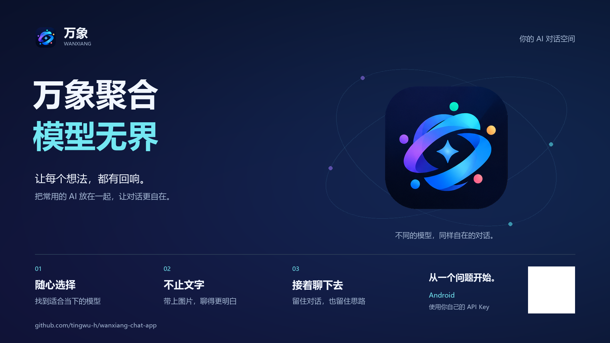
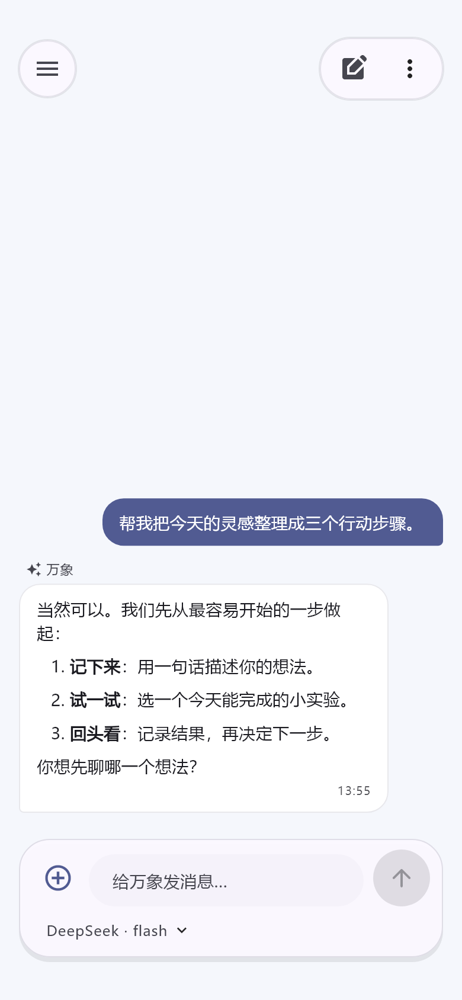
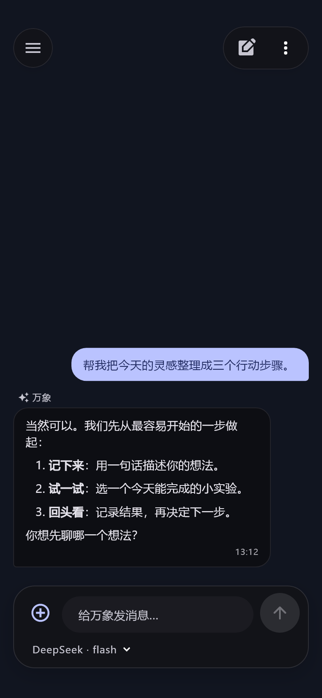
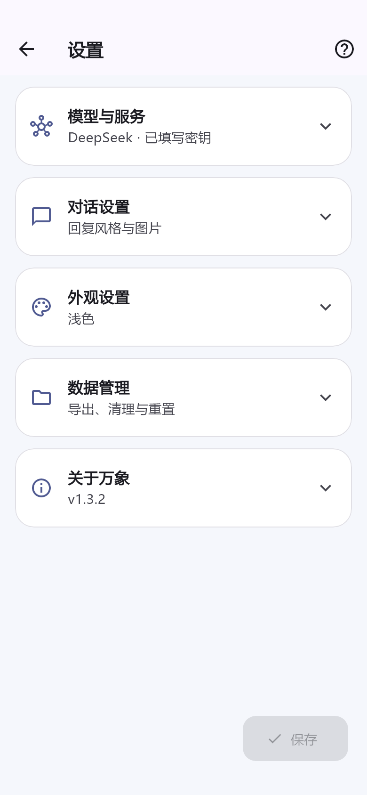

  
  <h1>万象 · Wanxiang</h1>
  
<a href="README.md">English</a> | <strong>简体中文</strong>

  
<strong>汇聚多种 AI，让每一次对话都有更多可能。</strong>

  
源码公开的 Android AI 助手 · 自由选择模型 · 使用自己的 API Key

  

    <a href="https://github.com/tingwu-h/wanxiang-chat-app/releases/download/v1.3.2/wanxiang-v1.3.2.apk">下载 APK</a> ·
    
    
    
    
  

  

    <a href="https://github.com/tingwu-h/wanxiang-chat-app/releases/tag/v1.3.2">v1.3.2 发布页</a> ·
    <a href="#preview">界面预览</a> ·
    <a href="#quick-start">开始使用</a> ·
    <a href="#providers">服务商</a> ·
    <a href="docs/1.3.2-更新说明.md">更新说明</a>
  

  

  <a href="docs/posters/wanxiang-poster-landscape.png">横版海报原图</a> ·
  <a href="docs/posters/wanxiang-poster-portrait.png">竖版海报原图</a>

## 项目简介

**万象**是一款运行在 Android 上的源码公开的 AI 聊天助手。它将 DeepSeek、OpenAI、Kimi、Qwen 等服务商放进同一个应用，让你按照问题和习惯选择模型，用文字、图片和文本附件展开对话。

从梳理一个想法、讨论一段代码，到追问图片中的细节，万象希望让这些日常对话更顺手：配置一次，随时切换，重要的讨论留在自己的会话记录里。

## 核心特点

- **自由选择模型**：九家预置服务商与自定义接口，按需选择账号可用的模型。
- **让对话自然延续**：流式回复、多会话历史，重新打开会话时恢复对应服务商和模型。
- **不止输入文字**：发送图片与纯文本附件，让支持相应能力的模型理解更多上下文。
- **适合长时间阅读**：Markdown 排版，搭配浅色与深色界面。
- **掌握自己的配置**：使用自己的 API Key；Android 密钥加密保存在本机。

## 看见万象

<table>
  <tr>
    <td align="center"><strong>浅色对话</strong></td>
    <td align="center"><strong>深色对话</strong></td>
    <td align="center"><strong>服务商设置</strong></td>
  </tr>
  <tr>
    <td></td>
    <td></td>
    <td></td>
  </tr>
</table>

以上为 Flutter 测试渲染的模拟会话截图，用于展示布局，不是真机实拍或服务商线上回复。

## 连接你常用的服务商

| 服务商 | 默认接入协议 | 配置方式 |
| --- | --- | --- |
| DeepSeek | OpenAI 兼容 Chat Completions | DeepSeek API Key 与账号可用模型 |
| OpenAI | OpenAI Responses | OpenAI API Key 与账号可用模型 |
| Kimi · Moonshot | OpenAI 兼容 Chat Completions | Moonshot API Key 与账号可用模型 |
| Qwen · 通义千问 | OpenAI 兼容 Chat Completions | DashScope API Key；默认中国内地接口 |
| Anthropic · Claude | Anthropic Messages | Anthropic API Key 与账号可用模型 |
| Google · Gemini | Google Gemini | Gemini API Key 与账号可用模型 |
| xAI · Grok | OpenAI 兼容 Chat Completions | xAI API Key 与账号可用模型 |
| GLM · 智谱 | OpenAI 兼容 Chat Completions | 智谱 API Key 与账号可用模型 |
| OpenRouter | OpenAI 兼容 Chat Completions | 自有 API Key；提供免费模型入口 |
| 自定义 | 可选择上述四类协议 | 填写 Base URL、API Key 和模型 ID |

预置模型仅用于方便配置，不代表你的账号已经获得调用权限。请以服务商当前开放的模型、区域和账号权限为准；可在设置中修改模型 ID、接口地址和图片能力。兼容接口的具体行为可能因服务商而异。

## 开始第一段对话

1. 前往 [v1.3.2 发布页](https://github.com/tingwu-h/wanxiang-chat-app/releases/tag/v1.3.2)查看版本说明与可用附件，也可以按下文从源码构建 APK。
2. 打开**设置 → 模型与服务**，选择服务商并填写自己的 API Key；点击**获取 API Key**可直达官方平台。
3. 选择模型，或填写账号当前可用的自定义模型 ID；需要时调整 Base URL。
4. 保存配置，可使用**测试连接**检查接口，然后回到聊天页开始对话。
5. 在输入框下方切换当前服务商的模型；更换服务商请进入设置 → 模型与服务。发送图片前，请确认所选模型具备视觉能力。

测试连接和聊天均会发出真实 API 请求，可能产生用量费用。API 资格、区域限制及计费由服务商管理；万象与这些服务商没有隶属关系。

<strong>从 DeepSeek 助手升级到万象</strong>

v1.3.2 的构建号为 **18**。为延续已有安装与数据，Android 包名仍为 `com.example.deepseek_chat`，沿用原有签名证书。不要为升级主动卸载旧版；真机覆盖安装与数据保留尚待验证，升级前建议导出重要聊天文字。

内部 Dart 包名、存储键和平台通道保留部分旧名称，用于兼容旧数据；对外品牌统一为**万象**。构建信息、APK 校验值与验证范围见 [v1.3.2 更新说明](docs/1.3.2-更新说明.md)。

## 设置更清楚，选模型更轻松

设置分为**模型与服务、对话设置、外观设置、数据管理、关于万象**五个可展开的分类，接口地址与协议收进高级设置。折叠或切换服务商时保留输入，离开前提醒保存。

模型附带编程、推理、写作、图片理解等参考标签。点击**选择免费模型**，可选 OpenRouter 免费自动选模、Qwen 免费变体或 Gemini Flash-Lite 免费额度，并直接打开官方 Key 申请页与额度说明。均需自己的 Key，额度、地区和数据政策以平台为准，不自动切换到付费模型。

[免费模型与获取渠道](docs/免费模型与获取渠道.md)

## 更顺手的聊天布局

聊天页隐藏会话名称，保留更大的阅读空间。菜单和新对话操作悬浮在顶部，输入框悬浮在底部，当前服务商的模型选择放在同一个输入窗口内。右上角更多菜单可导出当前会话文字或清空当前对话，不再重复显示新建对话。模型弹窗限制高度，支持上下滑动；每个模型使用独立圆角卡片展示名称和擅长标签，当前模型以主题色边框和勾选标记突出。文字滑向顶部或底部悬浮区域时自然淡出，方便用户继续查看之前的对话。服务商附带编程、推理、写作、长文、图片理解等参考标签；附件、模型和会话操作菜单统一为圆角，保存成功后提示短暂显示。自定义背景下，顶部和底部保留明显底色，仅透出少量背景。

## 外观与图片工具

支持简体中文、繁體中文和 English 界面切换。聊天背景可以选择颜色或上传图片；图片支持裁剪、缩放、放大输出，并在保存前自动压缩到 5 MB 以内。

## 你的密钥，你的数据

| 数据 | 保存或发送方式 |
| --- | --- |
| API Key | Android 使用 Keystore + AES-GCM 加密保存；普通设置不包含密钥。 |
| 聊天记录 | 保存在应用私有目录；聊天内容并非全部加密。 |
| 模型请求 | 发送到你配置的接口，包含认证信息、当前会话上下文及本次提交的附件内容。 |
| 聊天导出 | 包含聊天文字和附件名称，不包含 API Key、图片文件或本机图片路径。 |
| 系统备份 | 已排除应用数据；重要聊天文字请主动导出。 |

使用自定义地址前，请确认你信任该接口的运营方。提交问题反馈时，请去除密钥、私人聊天和其他敏感内容。

## 开发与贡献

本项目使用 Flutter + Provider。构建环境、离线打包、签名兼容、协议扩展及测试范围，见 [开发与构建指南](docs/DEVELOPMENT.zh-CN.md)。

## 项目进展

- 当前重点：完善 Android 的多模型体验，补充真实账号与真机升级验证。
- 后续方向：逐步探索桌面端，目前专注 Android。
- 本版边界：不包含联网搜索、工具执行、语音或 PDF / Word 文档解析。

## 参与万象

欢迎通过 [Issues](https://github.com/tingwu-h/wanxiang-chat-app/issues) 反馈问题或提出建议，也欢迎提交 Pull Request。反馈时请提供应用版本、Android 版本、服务商、模型 ID 与可复现步骤；提交代码前运行静态分析及相关测试。

Logo 由项目所有者提供，品牌素材位于 [assets/branding](assets/branding)。

## 许可证

**禁止商业使用。** 本项目采用 [万象非商业使用许可证 1.0](LICENSE)，允许依照条款进行非商业使用、学习、修改和分发，并须保留版权与许可证声明。修改版同样受禁止商用条款约束。

本项目公开源代码，并限制商业使用。第三方组件遵循各自许可证。此前按 MIT 发布的版本继续适用原有条款；新许可证适用于包含此次许可证变更的版本。

   
  <strong>万象，让不同模型在这里相遇。</strong> 
  <a href="#top">回到顶部 ↑</a>

